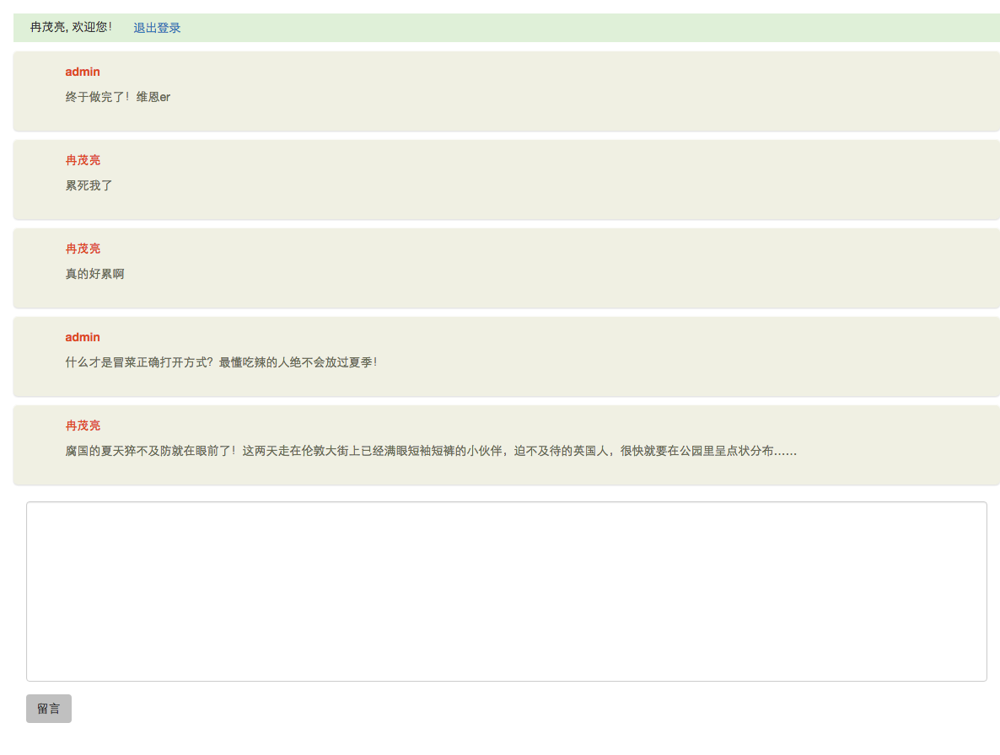
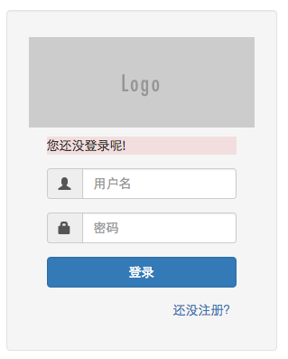
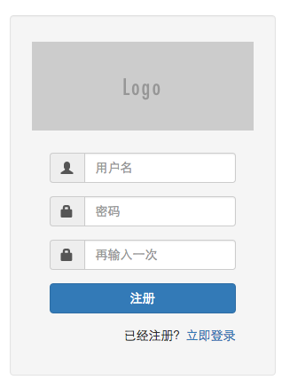

# 项目简介

项目功能描述：

+ 用户能登录、注册
+ 登录的用户可以往留言板留言，也可以修改留言板内的留言（自己发布的内容）
+ 留言板中显示留言的人和留言

## 项目截图

留言板



登录



注册



# 使用说明

## 下载项目

```
git clone https://git.oschina.net/zhengvo/express.git
cd  express
```

## 安装依赖

```
npm install
```

## 导入数据库

> 这里使用的是`mysql`数据库，为了您的项目能正常运行请是使用mysql数据库。

**创建数据库**

```sql
CREATE DATABASE `comments` DEFAULT CHARACTER SET utf8 COLLATE utf8_general_ci;
```

**导入数据**

在`sql/comments.sql`中包含演示所用的数据，请自行导入。

## 运行项目

```
npm start
```

运行项目，在浏览器中打开`http://localhost:3000`，首先进入的是登录界面，请使用`admin`、`ranml`、`冉茂亮`登录，密码均为`123456`。